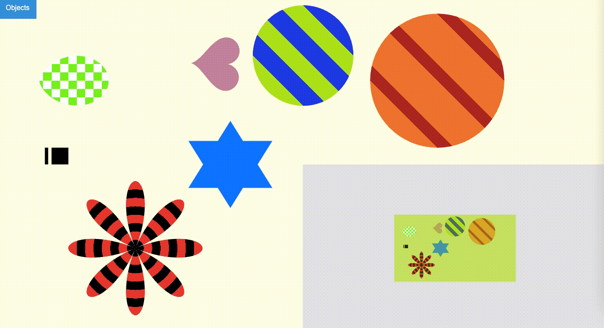
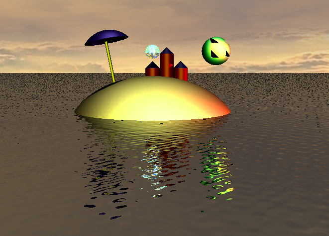

# computer-graphics
* **Description**: 2D and 3D computer graphics assignments using WebGL/JavaScript. To run the program, open **index.html**. You also need to unzip the WebGLMath folder and allow access from files from your browser. (For Chrome, the Terminal command is `open /Applications/Google\ Chrome.app --args --allow-file-access-from-files`).
* **Date**: February - June 2019
* **Special thanks**: Professor Szecsi (AIT) who provided the starter code and guidance.

**Project 1: 2D-basics**  
Includes simple and parametric shapes, patterns, animation, selection, position and orientation manipulation, editing, and view.

**Project 2: 2D-game**  
A simple 2D-game that meshes Gem Swap and basics of Space Invaders. Includes mouse and key action, movable and accelerable 2D avatar object, and orthocam.

**Project 3: 3D-basics**  
Includes movable 3D avatar object, helicam, texturing, lighting, and various shading.

**Project 4: 3D-ray**  
A ray tracer program that renders a beach scene. Includes shadows, reflections, and ripple effects.

